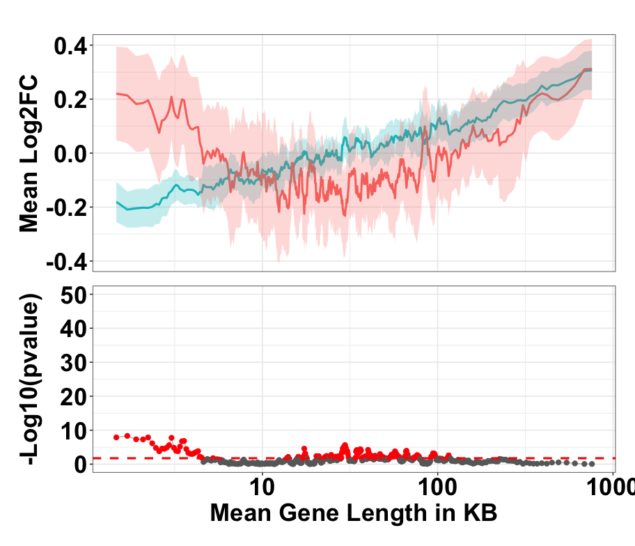
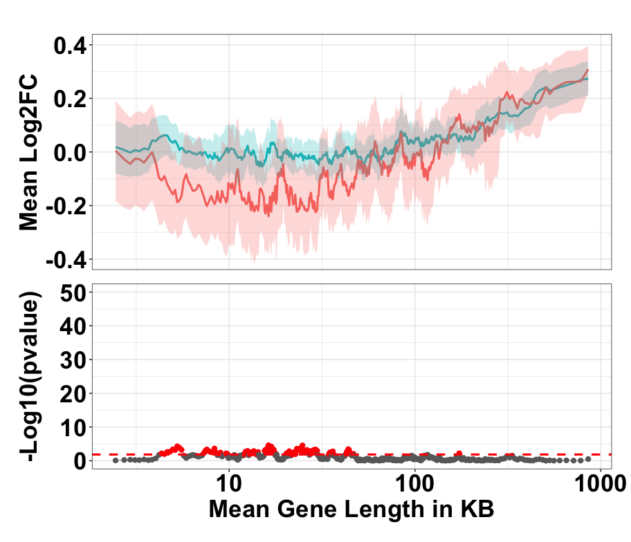

## README

 This work is licensed under a <a rel="license" href="http://creativecommons.org/licenses/by/4.0/">Creative Commons Attribution 4.0 International License</a>.

Overlap Plots for the long gene analysis by defining proper baseline variations.

### Contributors
1. Ayush T Raman [original authors]
2. Daniel Palacios [currently working on the bioconductor package]
3. Zhandong Liu [Supervised the work]

### Some examples of Overlap Plots for Boxer et al. (2020) dataset

1.  Overlap plot for KO/WT whole cell dataset

{width="350"}

2.  Overlap plot for KO/WT nuclear dataset

{width="350"}

3.  Overlap plot for KO/WT chromatin dataset

{width="350"}

### References:

1.  **AT Raman***, AE Pohodich*, YW Wan, HK Yalamanchili, HY Zoghbi, Z Liu. Apparent bias towards long gene misregulation in MeCP2 syndromes disappears after controlling for baseline variations. [*Nature Communications* (2018)](https://www.nature.com/articles/s41467-018-05627-1) (PMID: 30104565)

2.  **AT Raman**. A research parasite's perspective on establishing a baseline to avoid errors in secondary analyses. [*GigaScience* (2021)](https://academic.oup.com/gigascience/article/10/3/giab015/6168809) (PMID: 33710326)

### Inquiries

Please add issues if you have any questions/comments regarding the "overlap plots" or please contact directly at [aayushraman09\@gmail.com](mailto:aayushraman09@gmail.com){.email}.
